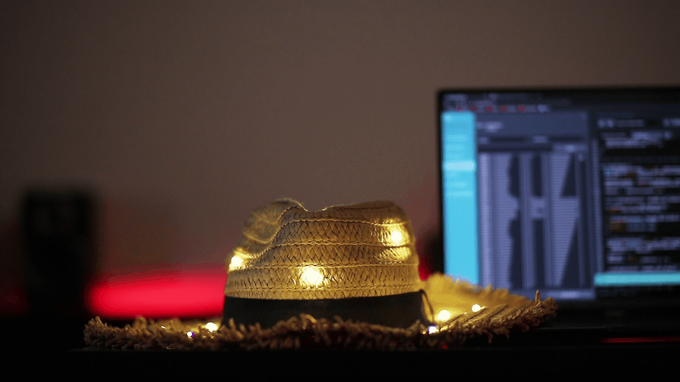

Micro Beat Detection
====================

This project uses analog input from sound sensors to detect beats on microcontrollers in real-time. It's lightweight enough to run on Arduino Nano compatible boards (e.g. using the ATMEGA168 or ATMEGA328P). It has been tuned for EDM and was tested during festivals as well as in home environments.

Showcased above is an audio reactive festival hat with LEDs that light up in sync with the music, you can watch a full video with sound [here](https://youtu.be/zm84h40ejuw).

## How It Works

In addition to using the overall audio signal amplitudes (time domain), it transforms the data using the [Fast Hartley Transform](http://wiki.openmusiclabs.com/wiki/ArduinoFHT) (frequency domain).

It then extracts some features from specific frequency bands and calculates a beat probability for each sample period.

That means that changes in _loudness_ (e.g. caused by a clap in a silent room) will not be classified as beat, however changes in _low frequencies_ (e.g. caused by music with bass) will.

## Getting Started

Connect the analog output of a microphone (e.g. the [MAX9814](https://www.adafruit.com/product/1713)) to pin `A0`. This pin will be configured to allow faster sampling from analog input. Refer to [this](http://yaab-arduino.blogspot.com/2015/02/fast-sampling-from-analog-input.htm) to learn more.

Deploy the `.ino` file onto your microcontroller. Without any modifications, you should see the onboard LED flashing up for each detected beat. You can also connect an external LED to pin `D9` to see the beat detection output.

To get an idea of what the beat detection is thinking, connect to the serial port with a baut rate of `115200`.

You should check out [this excellent blog post](https://blog.yavilevich.com/2016/08/arduino-sound-level-meter-and-spectrum-analyzer/) about the topic, it also explains parts of the code used in this project.